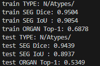
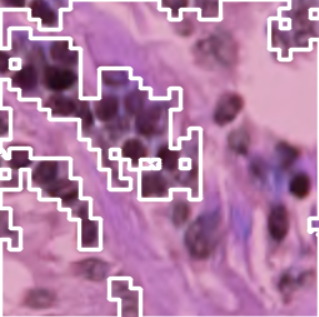

# 🧬 Pan-Cancer Nuclei Segmentation (PanNuke)

An **end-to-end deep learning pipeline** for nuclei segmentation and type prediction on the **PanNuke dataset**.  
This project integrates data preprocessing, training with **TransUNet** and evaluation, and prediction.

---

## 🚀 Features
- 🔄 **Automated Data Split** (train/test)
- 🧩 **Multi-task Learning**: Segmentation + Type prediction
- ⚡ **GPU-accelerated training** (PyTorch)
- 📊 **Comprehensive Evaluation** (Dice, IoU, F1, Accuracy)
- 💾 **Checkpointing**: Avoid redundant retraining
- 🔍 **Leakage Detection** between train/test sets

---

## ⚙️ Environment Setup

```bash
python -m venv .venv
# On Windows:
.venv\Scripts\activate
# On macOS/Linux:
source .venv/bin/activate

pip install -r requirements.txt
```

> **Note:** Please place the folder on Desktop to avoid path issues.

Tested with **Python 3.10+** and **PyTorch 2.1+**. For CUDA, install the matching `torch` build from the official [PyTorch instructions](https://pytorch.org/).

---

## 🖥️ Hardware Requirements

- **Operating System:** Linux / Windows / macOS
- **CPU:** Recommended 20 cores or more
- **RAM:** Recommended 64GB or more
- **GPU:** NVIDIA CUDA GPU with at least 16GB VRAM
- **Disk Space:** Recommended 100GB free space

### ✅ Test Environment
- Ubuntu 22.04
- Python 3.10
- CUDA 12.1, cuDNN 8.9
- NVIDIA RTX 5070Ti (16GB)

---

## 📂 Project Structure

```
pannuke_project/
├─ main_pipeline.py
├─ segmentor/
│  ├─ transunet.py
│  └─ train_segmentor.py
├─ preprocess/
│  ├─ data_loader.py
│  └─ shuffle_and_split_pannuke.py
├─ evaluate/
│  ├─ evaluate.py
│  └─ metrics.py
├─ data/
│  ├─ images/            # *_images.npy (raw bundles)
│  ├─ masks/             # *_masks.npy (raw bundles)
│  ├─ types/             # *_types.npy (raw bundles)
│  ├─ train/             # auto-generated split
│  └─ test/              # auto-generated split
├─ checkpoints/
│  ├─ dino/
│  └─ segmentor/
└─ predictions/
```

> **Important:** The pipeline uses relative paths. Keep `TEST_ROOT = PANNUKE_ROOT / 'test'` (avoid hard-coded absolute paths).

---

## 📊 Data Setup

Place your PanNuke bundles under `data/`:

- `data/images/*_images.npy`
- `data/masks/*_masks.npy`
- `data/types/*_types.npy`

### Split Options

**A. Auto-split (default in `main_pipeline.py`)**  
If `data/train/images.npy` is missing, the pipeline will:
- Find `*_images.npy` (and matching masks/types if present)
- Concatenate
- Create `data/train/` and `data/test/` according to `SPLIT_RATIO` (default = 0.8)

**B. Manual Split Script**
```bash
python preprocess/shuffle_and_split_pannuke.py --data_root data --train_ratio 0.8 --seed 42
```

---

## 🏋️ Training & Prediction

Run the full pipeline (auto-downloads DINO weights if missing):

```bash
python main_pipeline.py
```

Workflow:
1. Ensure pretrained DINO weights (download if needed)
2. Ensure dataset split (auto or existing)
3. Train via `segmentor/train_segmentor.py`
4. Save checkpoints to `checkpoints/segmentor/`
5. Predict results into `predictions/`:
   - `{split}_pred_types.npy`
   - `{split}_pred_seg.npy`
   - `single_masks/` (per-image exports)

### Environment Variables
- `ON_EXIST` = `ask` | `retrain` | `predict` → Behavior when `model_final.pth` exists
- `SEG_BSZ` (default `12`) → Batch size
- `SEG_WORKERS` (default `18`) → DataLoader workers
- `W_ORG` (default `0.2`) → Loss weight for organ branch
- `SPLIT_RATIO` (default `0.8`) → Train/test split ratio
- `SPLIT_SEED` (default `42`) → RNG seed
- `CUDA_VISIBLE_DEVICES` → Specify GPUs

Example:
```bash
ON_EXIST=retrain SEG_BSZ=8 SEG_WORKERS=8 python main_pipeline.py
```

---

## 📈 Results

### Training & Testing Metrics



### Segmentation Overlay Example



### Key Scores
| Split | Dice  | IoU   | Organ Top-1 |
|-------|-------|-------|-------------|
| Train | 0.9504 | 0.9054 | 0.6878 |
| Test  | 0.9439 | 0.8937 | 0.5349 |

📥 **Inference Download**: [Google Drive Link](https://drive.google.com/file/d/1d-w3jOuPZsPWLxZBIMaNjzvJdb8G2lT_/view?usp=sharing)

---

## 🖼️ Demo

**Inference build:** [Download here](https://drive.google.com/file/d/1d-w3jOuPZsPWLxZBIMaNjzvJdb8G2lT_/view?usp=sharing)


---

## ❗ Common Issues
- **Hard-coded paths** → Ensure `TEST_ROOT = PANNUKE_ROOT / 'test'`
- **Missing masks** → Verify `data/test/masks/*.npy` exists & matches `images` stems
- **Mixed shapes/logits** → Evaluation scripts handle `argmax`, but confirm model outputs
- **CUDA errors** → Set `CUDA_VISIBLE_DEVICES=` to force CPU or install CUDA-enabled PyTorch

---

## 📜 License & Dataset
This project trains on the **PanNuke dataset**. Please comply with the dataset’s license and citation requirements.

---

✨ Maintained with passion for advancing **computational pathology** and **medical imaging AI**.

